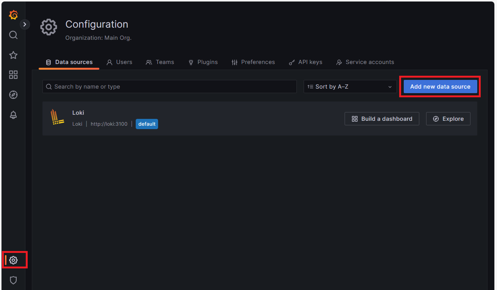
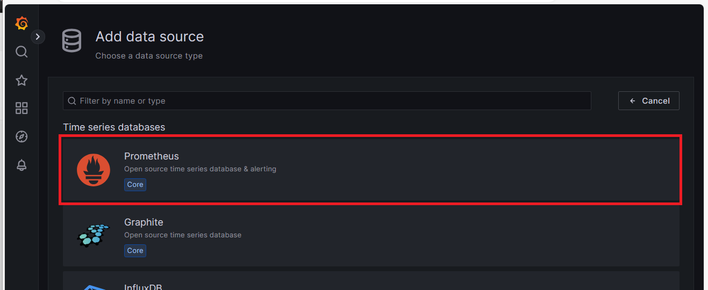
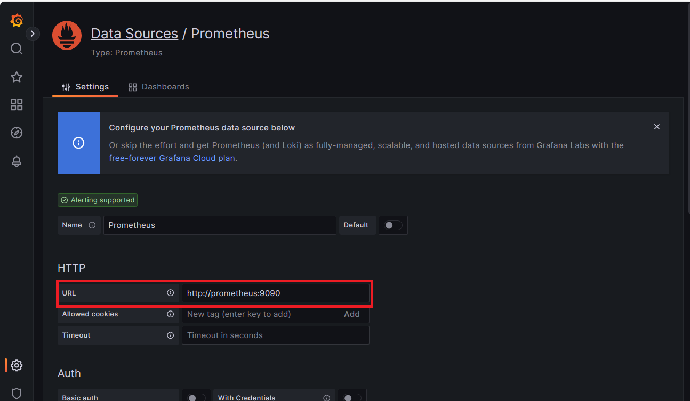
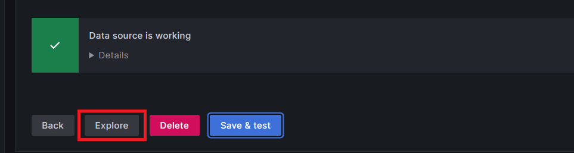
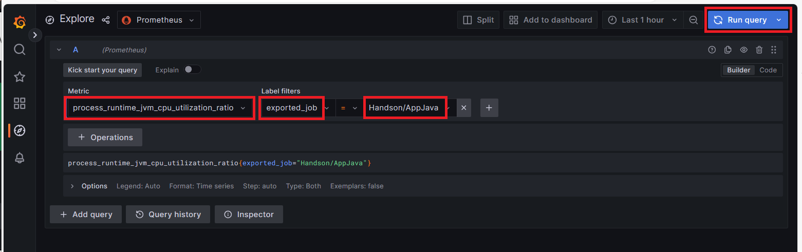
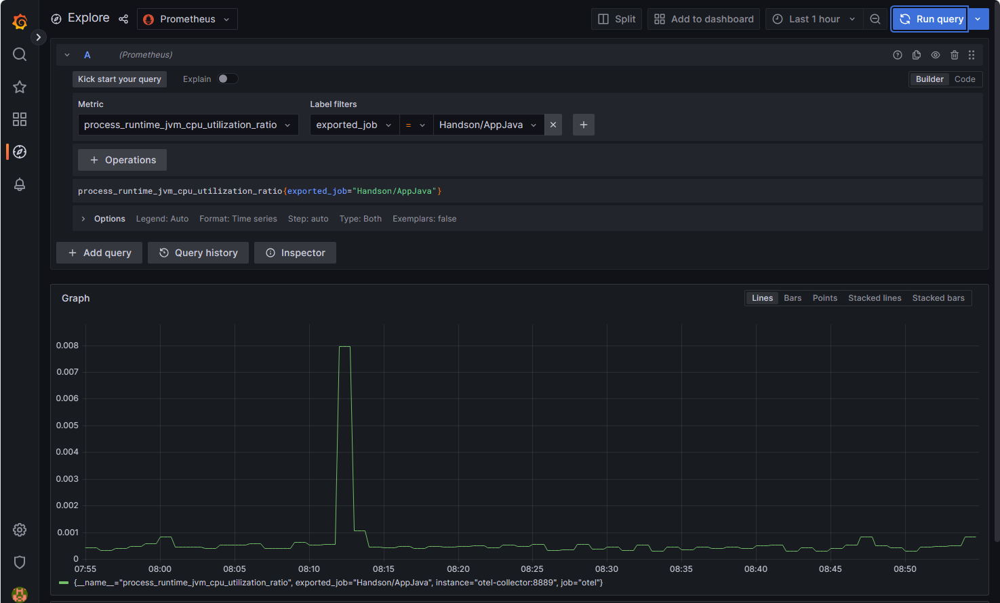
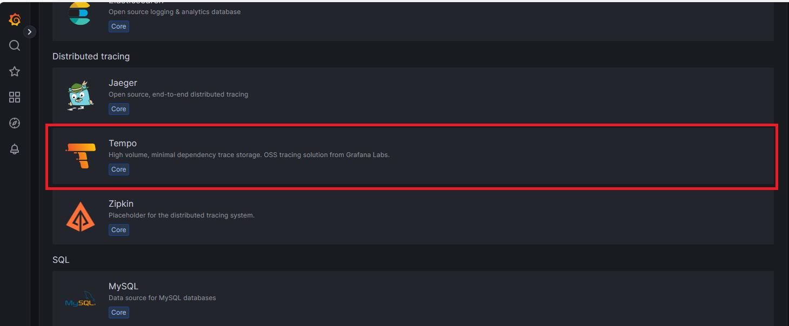
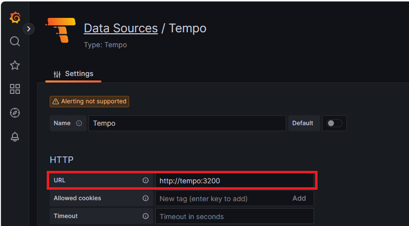
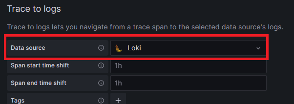
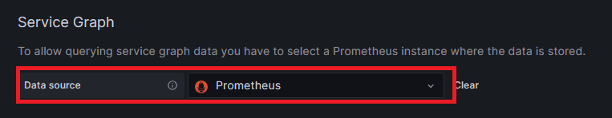

# Atividade 2

### Configurar os data sources do Grafana
Vamos executar uma aplicação Java com a observabilidade configurada, essa aplicação foi implantada numa imagem docker.
O coletor já está configurado para receber as métricas, logs e traces da aplicação e enviar para o Loki, Prometheus e Tempo.
Será utilizado o docker compose para executar os componentes da solução.

#### Passo 1
Abrir um linha de comando e ir até a pasta app, e executar o comando docker

```bash
docker-compose up -d
```


**Observação 1** - A primeira execução pode demorar, se as imagens não foram baixadas anteriormente.

**Observação 2** - Quando todos os conteineres estiverem no estado "Started", esperar uns 2 minutos até que o script SQL seja executado para criar a base de dados de exemplo.

#### Passo 2
Executar o request a API de teste para confirmar que a aplicação está respondendo, para isso abrir o arquivo request.http da pasta app com o VSCode.

Para executar o request clicar no texto "Send Request".

Esse request pode ser executado no Postman se preferirem.


A resposta deverá trazer um registro como na imagem.


Se o request não funcionar, existe a possibilidade de verificar no Docker Desktop se a aplicação está sendo executada de modo correto.


#### Passo 3

Agora iremos acessar o Grafana e realizar a configuração dos data sources para o Loki, Prometheus e Tempo.

Clicar no link abaixo para acessar o Grafana:

- [Grafana local](http://localhost:3000)

Será apresentado a tela inicial do Grafana.


Como o Grafana está configurado com a acesso anônimo no docker compose, não será necessário logar com nenhum usuário.


#### Passo 4

Agora vamos configurar o data source do Loki para podermos visualizar os logs dentro do Grafana.

Para configurar o data source do Loki, clicar na opção "Configuration" do menu lateral.


Na aba "Data sources", clicar no botão "Add data source".


Selecionar o item "Loki" na lista de opções.


Informar a url do Loki no campo URL, o valor a ser digitado no campo é "http://loki:3100".


**Observação 3** - Para facilitar a demonstração, o Loki, Prometheus e o Tempo foram configurados sem controle de acesso, em produção esses itens devem estar configurados com a segurança habilitada, com isso será necessário configurar a autenticação.

Para salvar o data source, clicar no botão "Save & test" no rodapé da página.


Após salvar o data source vamos explorar o log, para isso, clicar no botão "Explore".


Selecionar o item "service_name" no campo "label" e o valor "AppJava", e clicar em "Run Query".


Serão apresentados os registros do log armazenados no Loki.


#### Passo 5

Agora iremos configurar o data source para o Prometheus, para isso acessar novamente a opção "Configuration" do menu lateral, e clicar no botão "Add new data source".



Selecionar o item "Prometheus" na lista de opções.



Informar a url do Prometheus no campo URL, o valor a ser digitado no campo é "http://prometheus:9090".



Para salvar o data source, clicar no botão "Save & test" no rodapé da página.


Após salvar o data source vamos explorar as métricas, para isso, clicar no botão "Explore".



Selecionar a métrica "process_runtime_jvm_cpu_utilization_ratio", o item "exported_job" no campo "label" e o valor "Handson/AppJava", e clicar em "Run Query".



Será apresentado um gráfico com o valor da métrica.



#### Passo 6

Agora iremos configurar o data source para o Tempo, para isso acessar novamente a opção "Configuration" do menu lateral, e clicar no botão "Add new data source".


Selecionar o item "Tempo" na lista de opções.



Informar a url do Tempo no campo URL, o valor a ser digitado no campo é "http://tempo:3200".



Na seção "Trace to logs", no campo "Data Source" selecionar a opção "Loki", essa configuração permite a navegação do Trace para o Log.



Na seção "Service Graph", no campo "Data Source" selecionar a opção "Prometheus", essa configuração permite a visualização de métricas no grafico de nós.



Para salvar o data source, clicar no botão "Save & test" no rodapé da página.


Após salvar o data source vamos explorar os traces, para isso, clicar no botão "Explore".


Selecionar a métrica "process_runtime_jvm_cpu_utilization_ratio", o item "exported_job" no campo "label" e o valor "Handson/AppJava", e clicar em "Run Query".


Será apresentado um gráfico com o valor da métrica.


#### Passo 7

Explorar o log.

#### Passo 8

Explorar os traces.

#### Passo 9

Explorar as métricas.

Próxima atividade: [Atividade 03](03-atividade.md)


