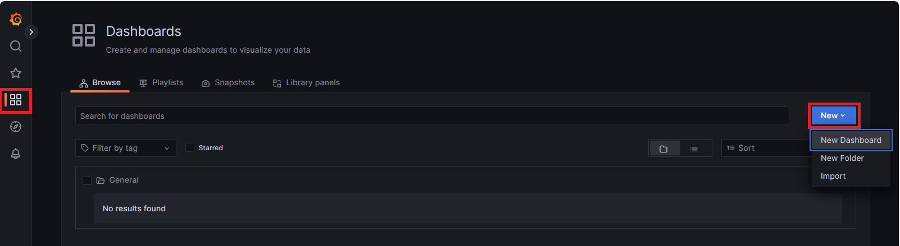
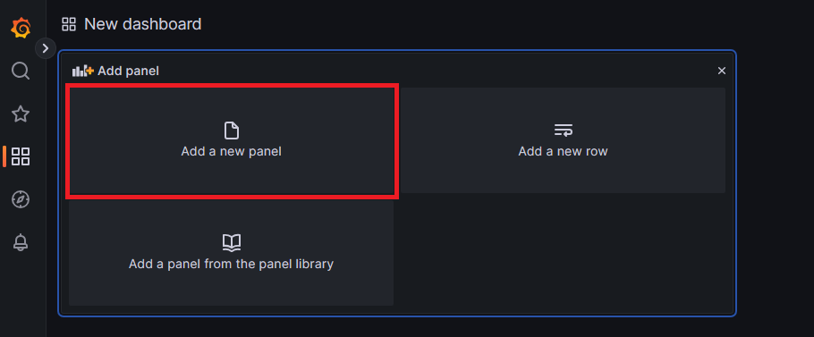
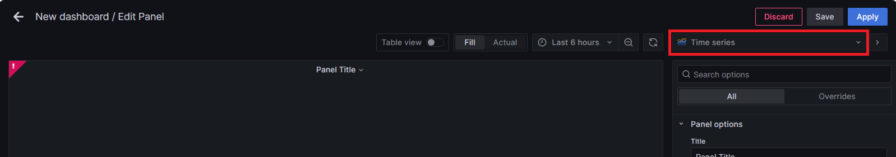
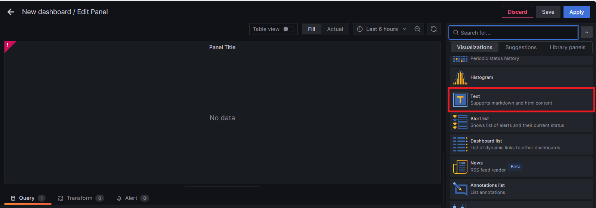
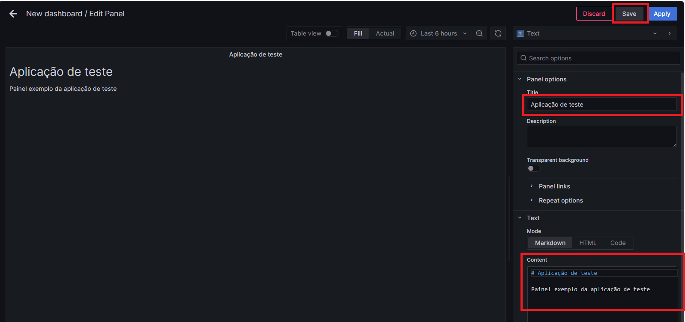
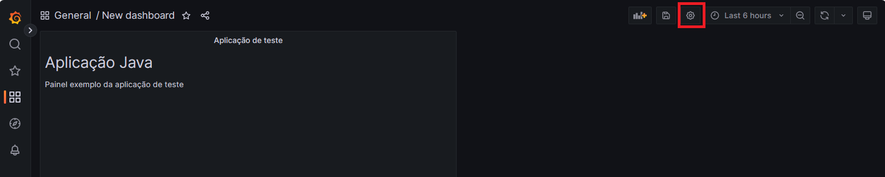
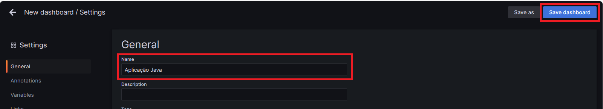
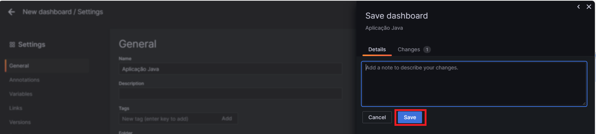
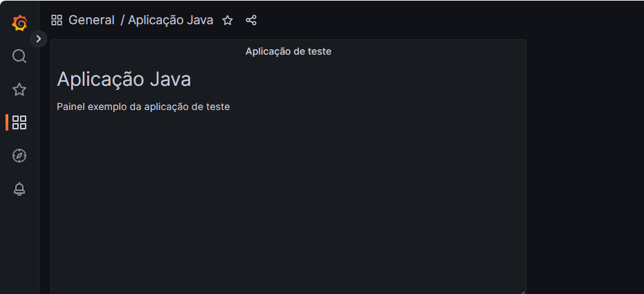

# Atividade 3

### Criar um dashboard no Grafana

Montar um dashboard no Grafana oferece várias vantagens em relação a uma exploração de dados ad-hoc. Aqui estão algumas das principais vantagens:

**Visualização Centralizada**: O Grafana permite criar dashboards centralizados que consolidam várias fontes de dados em um único local. Isso facilita a visualização e compreensão das informações sem a necessidade de alternar entre diferentes ferramentas.

**Monitoramento em Tempo Real**: Os dashboards do Grafana podem exibir dados em tempo real, permitindo monitorar métricas críticas e tomar decisões imediatas com base nessas informações em tempo real.

**Personalização e Interatividade**: Você pode personalizar completamente os dashboards do Grafana de acordo com suas necessidades. Além disso, muitos painéis são interativos, permitindo que os usuários explorem dados de maneira dinâmica.

**Alertas e Notificações**: O Grafana oferece recursos avançados de alerta, permitindo que você defina alertas com base em condições específicas nos dados. Isso ajuda a identificar rapidamente problemas e tomar medidas corretivas.

**Integração com Diversas Fontes de Dados**: O Grafana suporta uma ampla variedade de fontes de dados, desde bancos de dados SQL até sistemas de monitoramento e métricas. Isso possibilita a consolidação de dados provenientes de várias fontes em um único dashboard.

**Histórico e Análise de Tendências**: Dashboards do Grafana permitem a análise de tendências ao longo do tempo. Você pode visualizar o histórico de dados e identificar padrões ou anomalias que podem não ser imediatamente aparentes durante uma exploração de dados ad-hoc.

**Compartilhamento e Colaboração**: Dashboards do Grafana podem ser facilmente compartilhados com outras pessoas. Isso facilita a colaboração entre equipes, pois todos podem acessar as mesmas informações e análises.

Em resumo, ao montar um dashboard no Grafana, você obtém uma visão consolidada, personalizável e interativa dos seus dados, com recursos avançados de alerta e notificação, o que facilita a monitoração, análise e tomada de decisões informadas.

#### Passo 1

Clicar na opção "Dashboard" do menu lateral, depois clicar no botão "New" e clicar na opção "New Dashboard".



#### Passo 2

O painel de texto no Grafana é um componente que permite adicionar blocos de texto formatado aos dashboards. 

O painel de texto é frequentemente usado para fornecer documentação e descrições contextuais no próprio dashboard. Isso ajuda os usuários a entenderem melhor os dados apresentados, fornecendo informações adicionais, instruções ou contextos relevantes.

Vamos adicionar um panel de texto no dashboard. Para isso, clicar na opção "Add a new panel".



Em seguida, alterar o tipo de panel, clicando no combo de seleção de tipos de panel na lateral direita.



Selecionar o tipo "Text".



Editar o campo "Title", digitando o texto "Aplicação de teste".

Editar o campo "Content" digitando o texto abaixo: 

```markdown 
# Aplicação Java

Painel exemplo da aplicação de teste
```

Clicar em "Save" para salvar o painel.



O dashboard agora deve apresentar um panel com o texto digitado. 

#### Passo 3

O dashboard ainda está com o nome "New dashboard". Vamos editar o nome do dashboard, para isso, clicar no ícone da engrenagem no menu superior.



Digitar "Aplicação Java" no campo Name e clicar em "Save Dashboard".



**Observação:** O grafana permite registrar um comentário toda vez que um item é alterado, permitindo um rastreamento futuro das alterações.

Para confirmar a alteração clicar em "Save".



O resultado final deve ser igual ao da figura abaixo.




Próxima atividade: [Atividade 04](04-atividade.md)


