# Atividade 4

### Display do log

Vamos adicionar um novo painel no dashboard para mostramos o log da aplicação.

#### Passo 1

Adicione um novo painel clicando em "Add Panel"

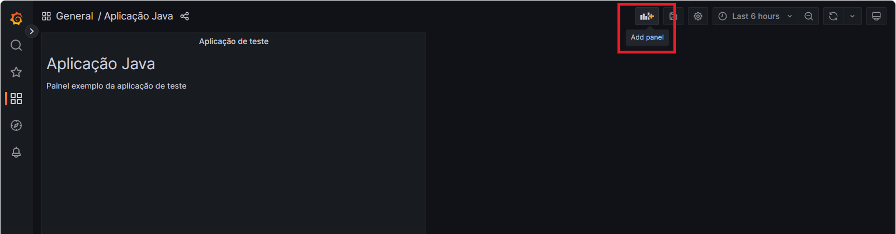

#### Passo 2

Clique na opção "Add a new panel".


#### Passo 3

Clique no combo da lista de tipos de painel e selecione o tipo "Logs".

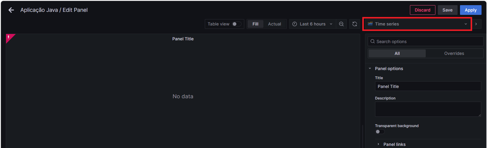

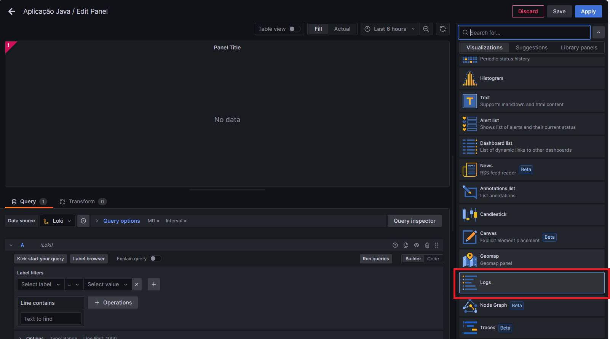

#### Passo 4

Edite o título do painel para "Log da aplicação".

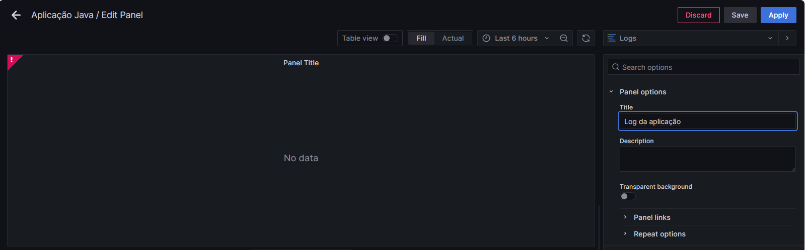

#### Passo 5

Configurar o datasource do painel, selecionando o datasource Loki que foi configurado anteriormente.

Configurar o label filters com as opções "job" e "Handson/AppJava".

Clicar em "Run queries" para verificar se os registros do log são carregados no painel.

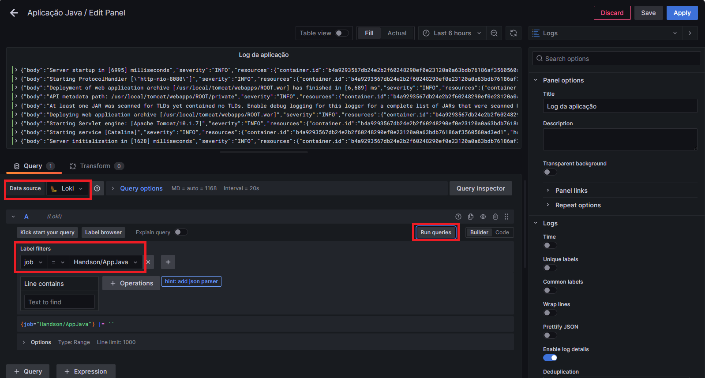

#### Passo 6

Clicar em "Save" para salvar o painel.

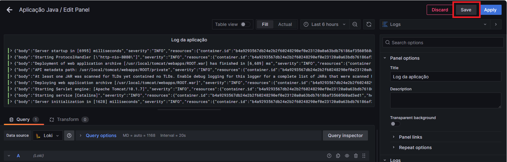

Preencher o campo de detalhes com o texto "Painel de log" e clicar em "Save".

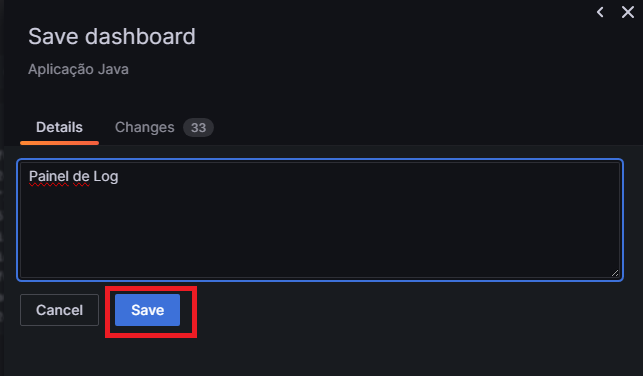

#### Passo 7

Clicar em "Apply" para retornar para a visualização do Dashboard.

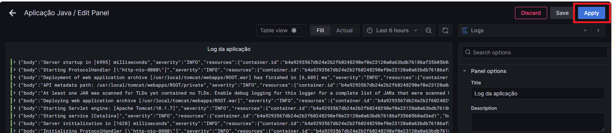

Reposicione o painel de log, para isso clique na barra superior do painel e mantenha o mouse clicado e arraste o painel para abaixo do painel do título.

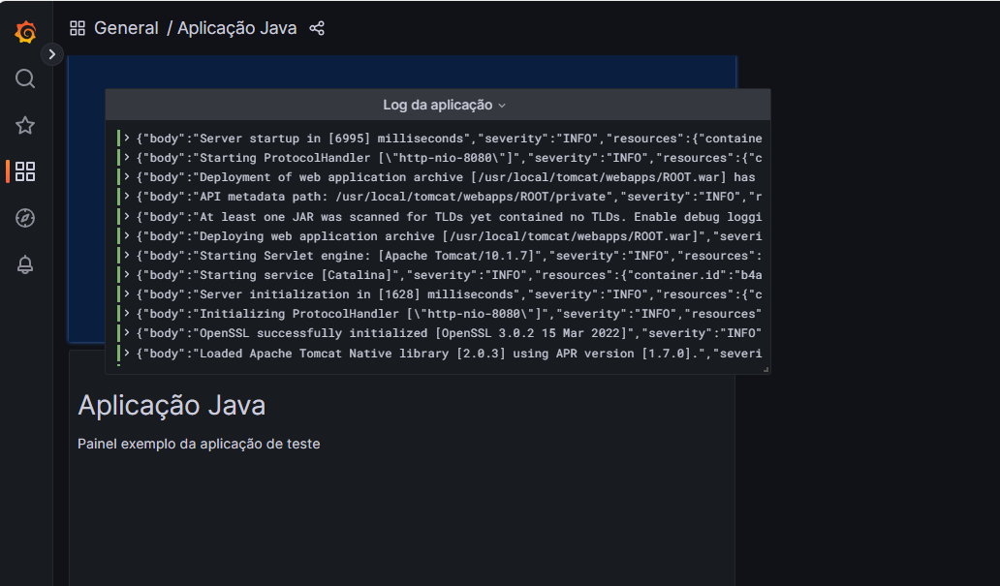

Aumente o tamanho do painel de log, clicando no canto inferior direito e arrastando a ponta, até que o componente ocupe a largura da tela.

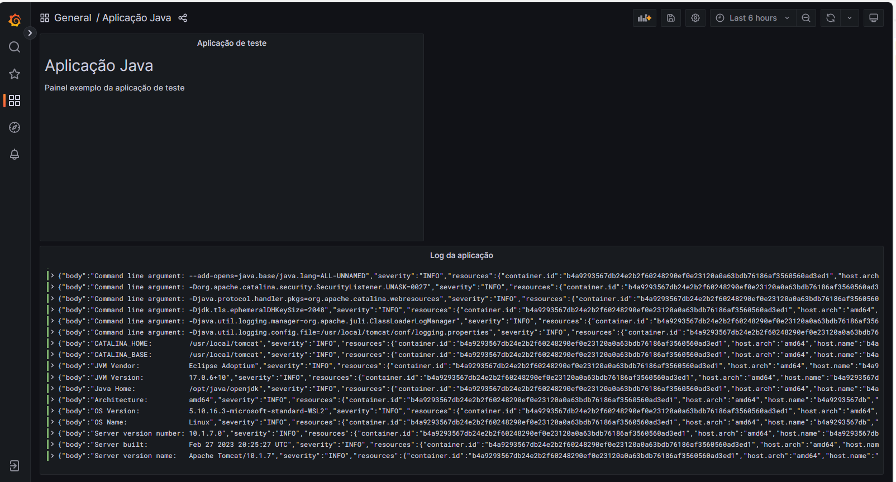

### LogQL

O LogQL é uma linguagem de consulta projetada especificamente para interagir com o Loki. Desenvolvido como parte do projeto Loki, o LogQL permite que os usuários pesquisem, filtrem e explorem os logs armazenados no Loki de maneira eficiente.

Vamos utilizar o LogQL mostrar apenas os erros no painel de log.

#### Passo 8
Vamos parar o container do banco de dados e com isso teremos um erro na aplicação Java, e vamos ver como o erro é apresentado no Grafana.

Para parar o container do banco de dados vamos usar o Docker Desktop, na opção "Containers", clicar no ícone de Stop da imagem "sqlserver-1"


#### Passo 9
Vamos executar o request e ver o erro. A resposta deverá trazer uma mensagem de erro como na imagem.


#### Passo 10
Editar o painel de log.

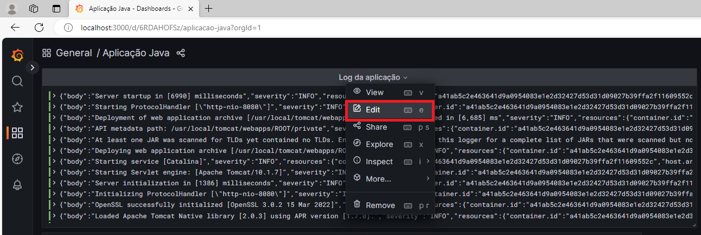

#### Passo 11
Clicar no botão "Code" para editar a query.

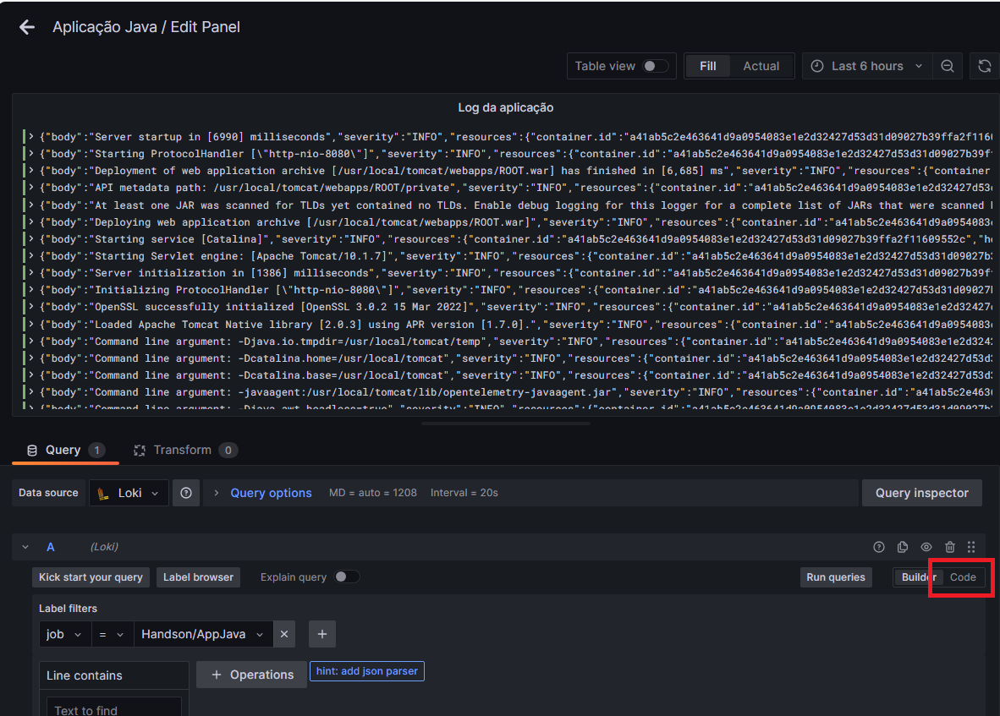

#### Passo 12
Editar a query adicionando a condição para filtrar o texto "ERROR":

```code
{job="Handson/AppJava"} |= `ERROR` 
```

 e clicar em "Run Queries".

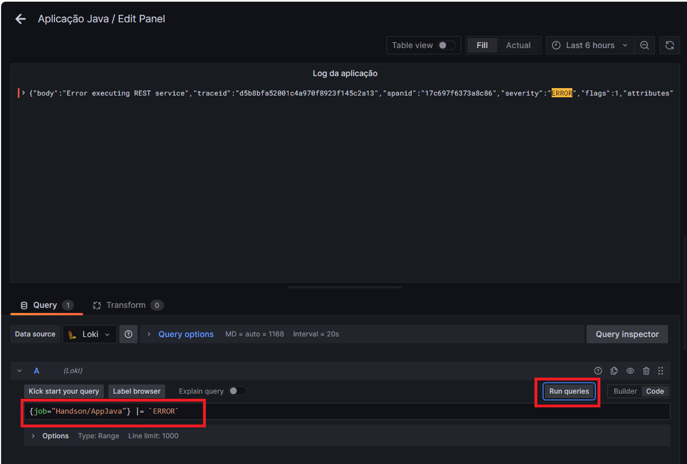

#### Passo 13

Clicar em "Save" para salvar o painel.

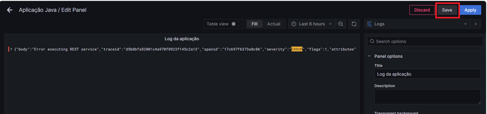

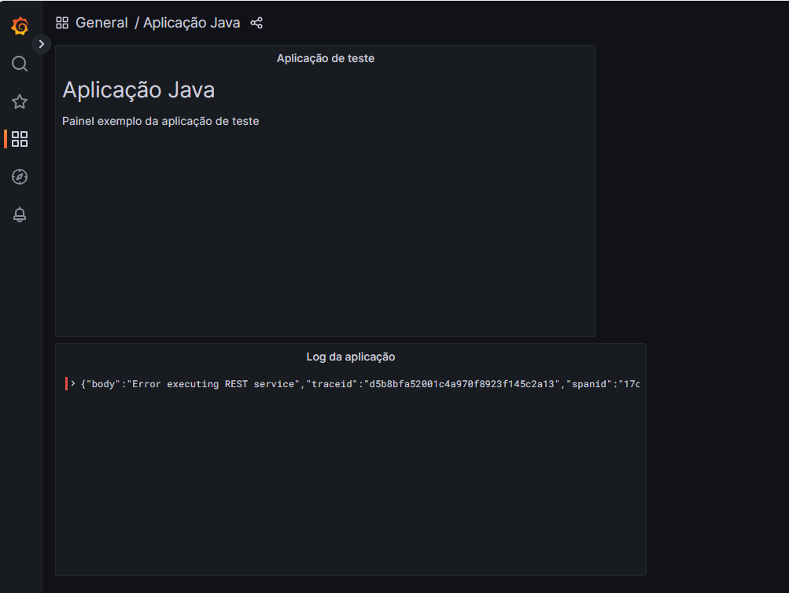


Próxima atividade: [Atividade 05](05-atividade.md)