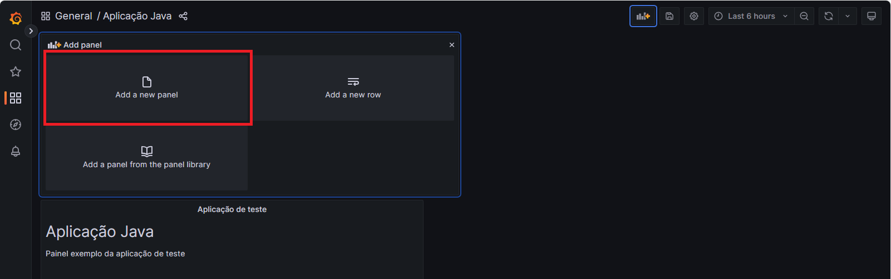
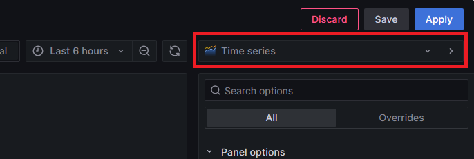
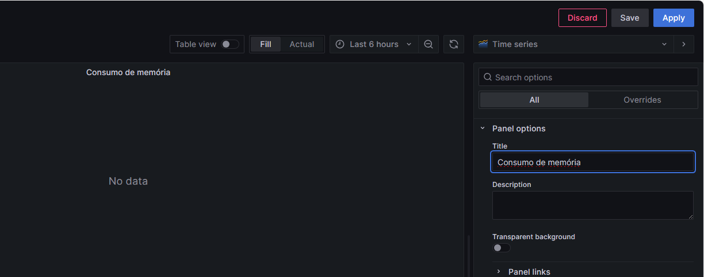
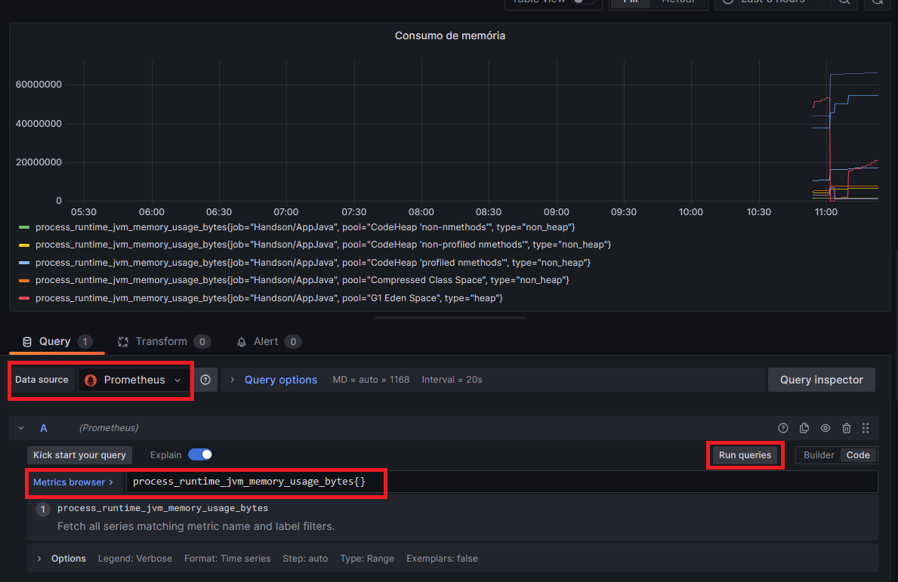
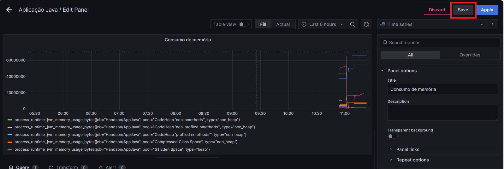
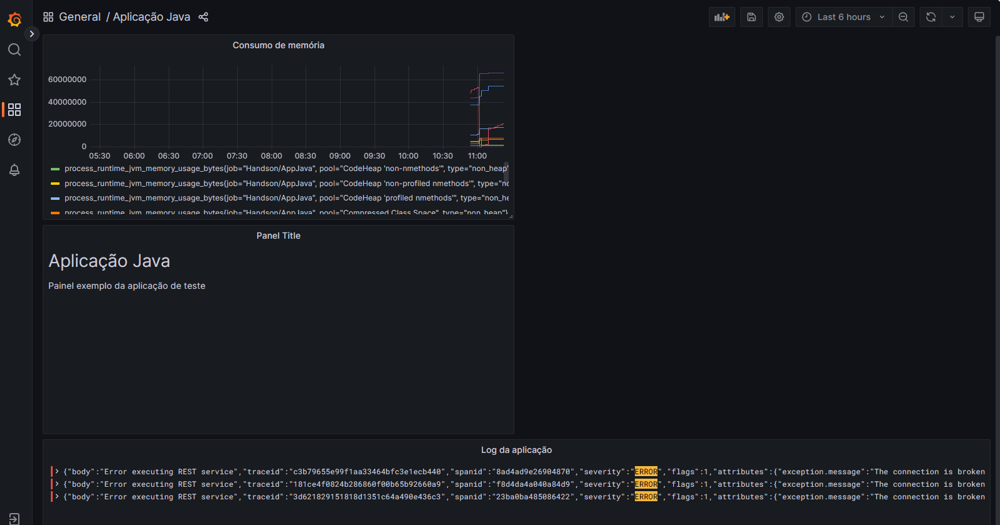
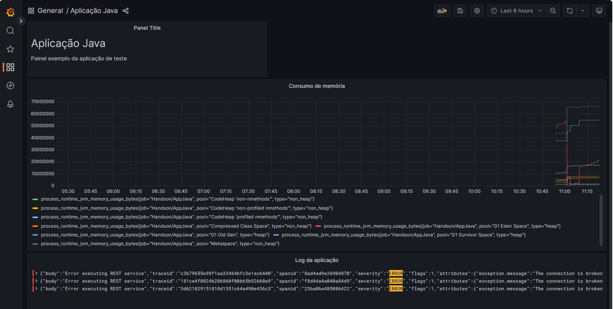

# Atividade 5

### Gráfico de linha

Criar um componente de gráfico de linha para uma métrica.

#### Passo 1

Adicione um novo painel clicando em "Add Panel".

#### Passo 2

Clique na opção "Add a new panel".

#### Passo 3

Mantenha no combo da lista de tipos de painel com o tipo "Time Series".

Edite o título do painel para "Consumo de memória".

#### Passo 4

Configurar o datasource do painel, selecionando o datasource Prometheus que foi configurado anteriormente.

Configurar a métrica com o valor "process_runtime_jvm_memory_usage_bytes{}".

Clicar em "Run queries" para verificar se o gráfico é carregado.

#### Passo 5

Clicar em "Save" para salvar o painel.

Clicar em "Save" na tela de detalhes.

#### Passo 7

Clicar em "Apply" para retornar para a visualização do Dashboard.

Reposicione o painel do chart, para isso clique na barra superior do painel e mantenha o mouse clicado e arraste o painel para abaixo do painel do título. 

Redimensione os elementos como a imagem abaixo.

Próxima atividade: [Atividade 06](06-atividade.md)