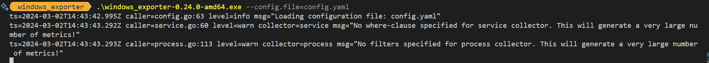
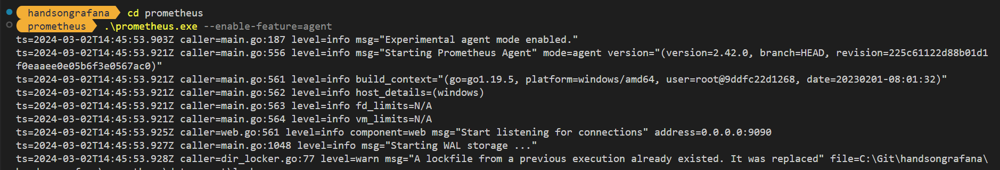
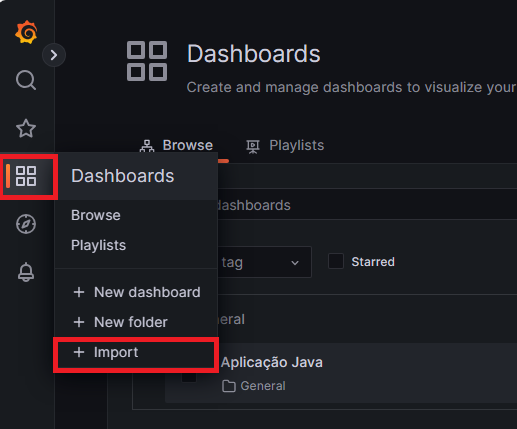
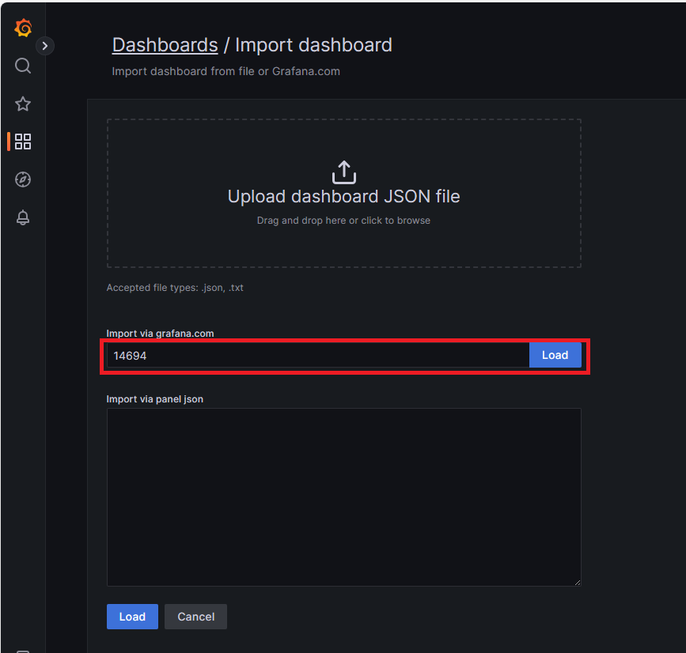
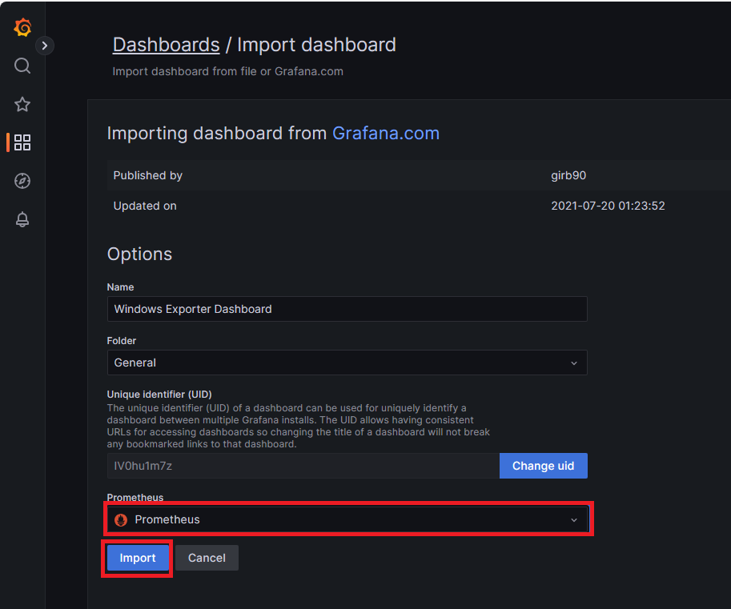
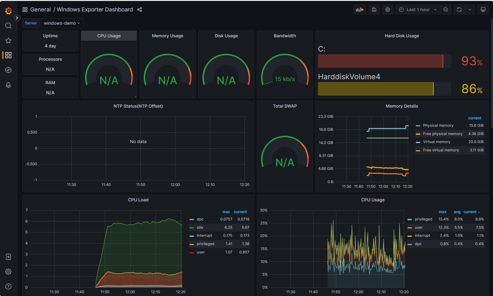

# Atividade 9

### Importar um template de monitoramento de um Windows Server

Importar um template de monitoramento de um Windows Server

Para exportar as métricas do Windows para o Prometheus iremos utilizar o Windows Exporter.

- [Documentação Windows Exporter](https://github.com/prometheus-community/windows_exporter)

#### Passo 1

Criar a pasta C:\temp\metrics que será utilizado pelo Windows Exporter.

#### Passo 2

Abrir um prompt de linha de comando e ir até a pasta windows_exporter, e executar o comando abaixo para executar o Windows Exporter.

```bash
windows_exporter-0.24.0-amd64.exe --config.file=config.yaml
```



#### Passo 3

Abrir um prompt de linha de comando e ir até a pasta prometheus, e executar o comando abaixo para executar o agente do prometheus.

```bash
prometheus.exe --enable-feature=agent
```


#### Passo 4

Agora iremos importar o template de dashboard, para isso, clicar no ícone do dashboard no menu lateral, e clicar em "Import". 



#### Passo 5

Informar o valor 14694 no campo "Import via grafana.com" e clicar no botão load. 



#### Passo 6

Selecionar o datasource Prometheus e clicar em Import.






