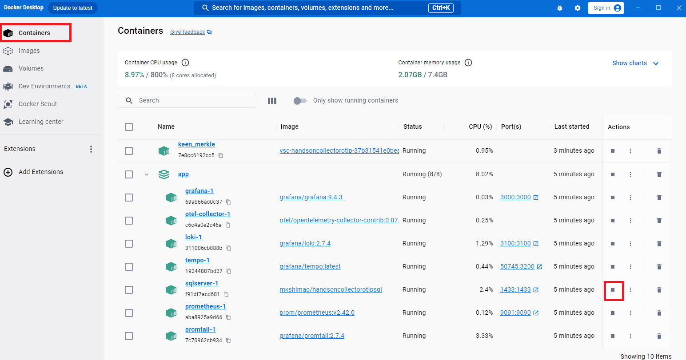
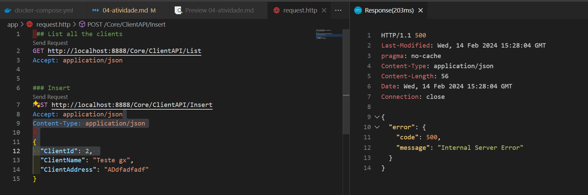

# Atividade 7

### Simular um erro na aplicação e visualizar no Grafana
Vamos parar o container do banco de dados e com isso teremos um erro na aplicação Java, e vamos ver como o erro é apresentado no Grafana.

#### Passo 1
Para parar o container do banco de dados vamos usar o Docker Desktop, na opção "Containers", clicar no ícone de Stop da imagem "sqlserver-1"

#### Passo 2
Vamos executar o request e ver o erro. A resposta deverá trazer uma mensagem de erro como na imagem.

#### Passo 3
Agora vamos ver como o erro é apresentado no Grafana.

Próxima atividade: [Atividade 08](08-atividade.md)